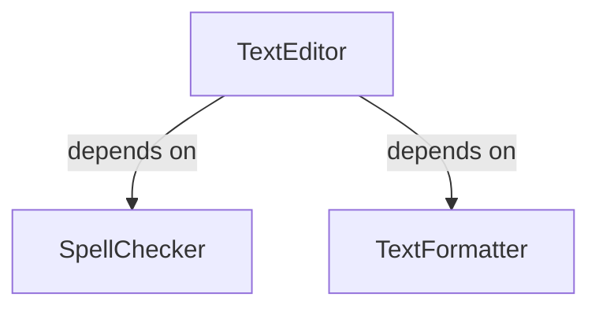
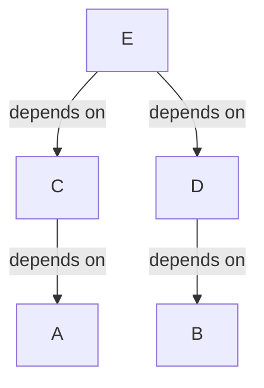

# Dependency Injection (DI)

Design pattern that decouples the usage of an object from its creation. Instead of instantiating the collaborators
inside the class, they are instantiated somewhere else and provided to that class via dependency injector.

The `Dependency Injection` pattern utilizes the [Inversion Of Control](../../principle/inversionofcontrol/README.md)]
principle.

## Pros

- Makes the application easier to test
- Increases the modularity of the program
- Manages an object’s life-cycle (some objects can be singletons, while we can create others per
  request)

## Example

Let's consider example where application has a text-editor. The text-editor provides spell checking and text
formatting. The standard code would look something like this:

```kotlin
// Class
class TextEditor {
    // Class creates the dependencies internally
    private val spellChecker = SpellChecker()
    private val textFormatter = TextFormatter()

    // use the spellChecker
}

// Client using the class
val textEditor = TextEditor(spellChecker)
```

Here is the dependencies graph:



The `TextEditor` is directly dependent on the `SpellChecker` and `TextFormatter`. The `TextEditor` class has control
over which `SpellChecker` and `TextFormatter` implementation to use, because the `TextEditor` handles the creation of
these classes. This violates the [Dependency Inversion](../../principle/solid/dependencyinversion/README.md)

Also, the [Single Responsibility Principle](../../principle/solid/singleresponsibility/README.md) is violated
because `TextEditor` class has an additional responsibility - object creation.

This implementation may be improved by instantiating dependencies (`SpellChecker` and `TextEditor`) outside the
`TextEditor` class and injecting them (`Dependency Injection` pattern).

### Property injection

One way of providing the dependency is the property injection (setter injection). The `SpellChecker` instance can be
created outside the `TextEditor` class and provided via property setter:

```kotlin
// Class
class TextEditor(val spellChecker: SpellChecker) {

    // use the spellChecker
}

// Client using the class
val spellChecker = SpellChecker()
val textEditor = TextEditor()
textEditor.spellChecker = spellChecker // Client is providing the dependency
```

The above solution allows to provide `SpellChecker` dependency, however it is not recommended in this case.
Notice that property injection may leave objects in an uninitialized or partially initialized state, because there is
no compile-time guarantee that all the required dependencies will be provided.

The property injection should be used only when object creation is out of developer control (e.g. object created, by
library). For this scenario constructor injection is a better option.

### Constructor injection

Constructor injection is the preferred way of providing dependencies. It should be favoured over property injection
when possible. This time the `SpellChecker` instance is created outside the `TextEditor` class and provided via class
constructor:

```kotlin
// Class
class TextEditor(private val spellChecker: SpellChecker) {

    // use the spellChecker
}

// Client using the class
val spellChecker = SpellChecker()
val textEditor = TextEditor(spellChecker)  // Client is providing the dependency
```

The main advantage of using constructor injection ios the compile-time guarantee that all the required dependencies
will be provided.

### Conclusion

The `TextEditor` class is no longer responsible for creating its dependencies. The client creating the
`TextEditor` class has control over which `SpellChecker` implementation to use because it is
providing (injecting) the dependency into the `TextEditor` instance.

Control over dependency creation was transferred (inverted) from the class (`TextEditor`) to the client:

| Tables          |  Class  |  Client |
|-----------------|:-------:|--------:|
| Standard        | Control |         |
| DI (siting IoC) |         | Control |

The above code can still be improved, because it
violates [Open-Closed principle](../../principle/solid/openclosed/README.md).

## Automatic Dependency Injection

The above example presents the manual dependency injection. Let’s consider a more complex scenario:



The `Class A` and `Class B` have no dependencies. The `Class C` depends on `Class A`. The `Class D` depends on
`Class B`, and `Class E` depends on both `Class C` and `Class D`. To create an instance of `Class E` all of the required
dependencies have to be provided - instances of Classes `A`, `B`, `C`, and `D` have to be created
in particular order:

```kotlin
// Create instances of `Class A` and `Class B` because they have no dependencies
val classA = ClassA()
val classB = ClassB()

// Create instances of `Class C` and `Class D` because instances of their dependencies (`Class A` and `Class B`) exists
val classC = ClassC(classA)
val classD = ClassD(classB)

// Create an instance of `Class E`
val classE = ClassD(classC, classD)
```

This is a simple example with just 5 classes, yet it requires a bit of code and mental overhead to determine right
dependency creation order. In real-life projects there could be hundreds of classes that have to be instantiated.

The object lifecycle must be taken into consideration. Let's assume `Class C` have to be
a [Singleton](../../pattern/singleton/README.md) and `Class D` need to be created
at every request. Handling this scenario manually would increase the code complexity (a lot of logic and
redundant code).

Manually doing dependency injection at scale is not a good idea. The solution is to automate dependency injection
process by utilising a dependency injection framework. The frameworks will control the creation and lifecycle of the
objects removing the need to manually create these objects.
