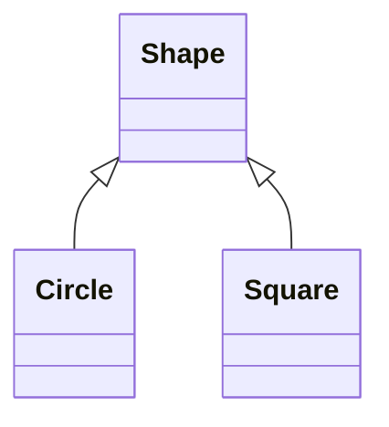
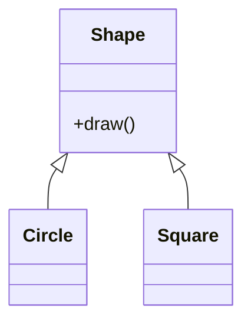
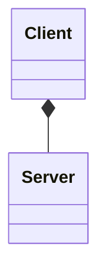
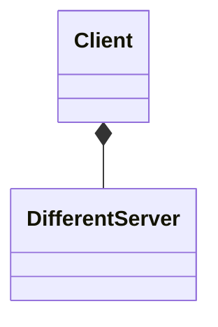
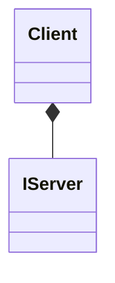
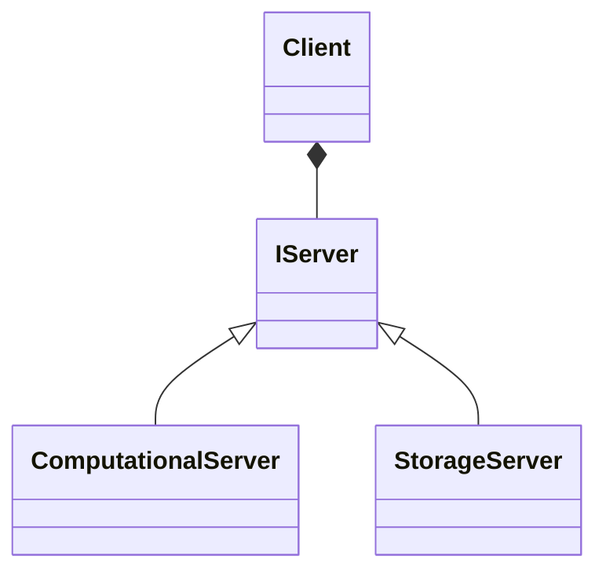
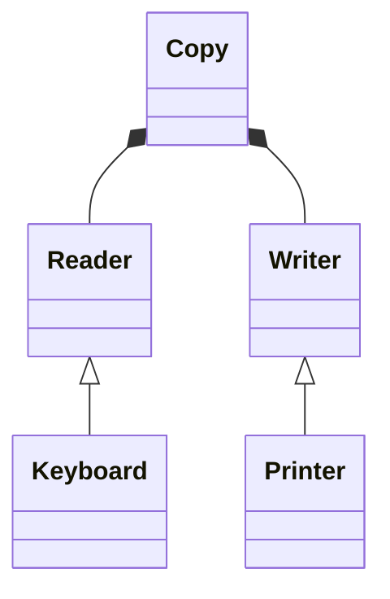

# Open/Closed Principle (OCP)

The Open/Closed Principle is the `O` of [SOLID](../README.md).

This principle states that code should be **open** for extension and **closed** for modification.

Open for extension means that behavior of the class\module can be extended.

Closed for modification means that behaviour change (extension) of the class\module must be achievable without changing
the existing code.

Let look at few examples to better understand this principle.

## Example 1 - DrawAllShapes Method

Let look at class diagram method:



```kotlin
class Square()
class Circle()
```

Drawing a shape requires a `when` block with all the possible shapes in the `drawAllShapes` function:

```kotlin
fun drawAllShapes(shapes: List<Shape>) {
    shapes.forEach {
        when(it.type) {
            ShapeType.CIRCLE -> {
                drawCircle(it as Circle)
            }
            ShapeType.SQUARE -> {
                drawSquare(it as Square)
            }
        }
    }
}
```

The above implementation of `drawAllShapes` violates `OCP` because `drawAllShapes` function is not closed against new kind of shapes - `drawAllShapes` function have to be modified after adding a new shape.

Let's update this code to be conformed with `OCP` by adding `draw` metod to the `SHape` class:



```kotlin
abstract class Shape {
    fun draw()
}

class Square() {
    override fun draw() {

    }
}
class Circle() {
    override fun draw() {
        
    }
}
```

The `draw` method defined in the parent class allows to `drawAllShapes` method to draw all shapes:

```kotlin
fun drawAllShapes(shapes: List<Shape>) {
    shapes.forEach {
        it.draw()
    }
}
```

Now `drawAllShapes` method conforms to `OCP`, because it is:

- `Open` for extension - new kinds of shapes can be drawn by the `drawAllShapes` method
- `Closed` for modification - no need to change `drawAllShapes` method when new shape is added

## Example 2 - Client-Sever

Let's looks at the class design that does not conform to the `OCP`:

```kotlin
class Client {
    val server: Server
}

class Server
```



The `Client` class is not closed against new kinds of servers - if we wish for a `Client` to use a different
server `Server`, then the `Client` class must be modified to use a new server class:



```kotlin
class Client {
    val differentServer: DifferentServer
}

class DifferentServer
```

To make `Client` closed against new kinds of servers the
`Client` class should depend on the server abstraction, rather than a concrete server implementation (`Server`  class):



```kotlin
class Client {
    val server: IServer
}

interface IServer
```

To allow the the `Client` class use various server implementations the `IServer` instance is passed in the `Client`
class constructor rather than being instanciated in the class:

```kotlin
class Client(private val server: IServer) {

}

interface IServer
```

Now it is possible to define new kinds os servers:



```kotlin
class Client {
    val server: IServer
}

interface IServer

class StorageServer : IServer
interface ComputationalServer : IServer
```

And finally server instance is provided when defining the `Client` instance:

```kotlin
val server = ComputationalServer()
val client = Client(server)
```

Now `Client` class conforms to `OCP`, because it is:

- `Open` for extension - new kinds of `Servers` can be used by the `Client` class
- `Closed` for modification - no need to change `Client` class when new server type is added

### Example 3 - Copy



Class `Copy` conforms to `OCP`, because It is:

- `Open` for extension - new versions of “Readers” and “Writers” can be created
- `Closed` for modification - `Copy` don't have to be modified to support these extensions

## Summary

The ideal scenario for `OCP` principle it to reduce amout of changed code to bare minimum ideally zero, however no
significant program can be 100% closed. Since cannot be complete, it must be strategic (classes are closed to most
common changes that are expected).
